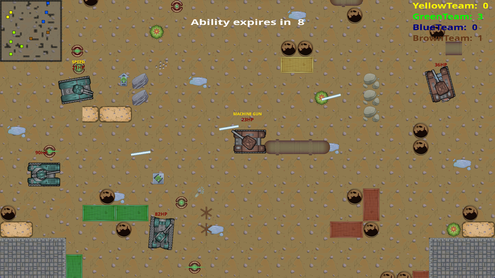

# Tanc(++)erman - SDL game made for an academic task

# Caracteristics :
- [x] polymorphism implemented through the interface inherited by all objects
- [x] ai altgorithm -> based on the algorithm A*
- [x] dedicated class for space managing
- [x] dedicated class for objects interations 
- [x] dedicated class for game timing
- [x] dedicated class for animations
- [x] dedicated class for assets storage

# Implemented design patterns 
- [x] obsever - mechanism for frame by frame updating&drawing 
- [x] mediator - work as an "traffic intersection"
- [x] factory - basically there is a class called director that takes a builder,
		    instruct him and return the result

# Preview

